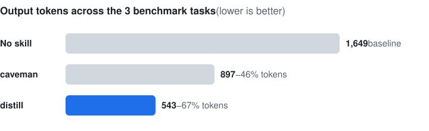

<div align="center">

# distill

**Make Claude answer like a senior engineer: short, exact, professional.**

A skill for Claude Code and claude.ai that cuts **62% of output tokens** on an 8-task benchmark,<br>
keeps every answer correct, and never talks like a caveman.

[](https://github.com/sahilnikam2410/distill/actions/workflows/ci.yml)
[](CHANGELOG.md)
[](LICENSE)
[](#install)

[Install](#install) · [Before and after](#before-and-after) · [Benchmark](#benchmark) · [Levels](#levels) · [FAQ](#faq)



</div>

## Why

Claude's default answers are thorough, which is great until you are reading your fourth "Great question!" of the hour, scrolling past a recap of what it just did, or burning through a usage cap.

"Talk like a caveman" skills fix the length but break the tone ("Effect run twice. Not bug."), and they only shorten the *words*. The *work* — file reads, tool calls, log dumps — stays as expensive as before.

distill fixes both:

- **Replies** lead with the answer, stay inside a word budget, and use grammatical, labeled fragments a colleague would write.
- **Work** follows lean rules too: search before reading, parallel tool calls, no re-reads, filtered output, stop when done.
- **Accuracy is protected.** Code, commands, paths, error messages, numbers and negations are never shortened. Security warnings and irreversible actions switch to full sentences.

## Before and after

Same prompts. These are the saved replies from the benchmark ([`benchmark/results/`](benchmark/results)).

**Prompt:** *"my useEffect runs twice when the component mounts in dev mode, why?? and how do i stop it. react 18 + vite"*

| | Reply opens with | Tokens |
|---|---|---|
| No skill | "This is expected, and it's caused by **React 18's `<StrictMode>`**, not by Vite or a bug in your code. ## Why it happens …" | 1,148 |
| caveman | "Not bug. Usually not need stop. Fix effect instead: add cleanup." | 551 |
| **distill** | "Cause: `<StrictMode>` in `main.jsx`. In dev only, React 18 mounts → unmounts → remounts every component to expose effects that lack cleanup." | **299** |

**Prompt:** *"tests are failing in the shop project, coupon totals are wrong. find the bug and fix it"* (an agentic task in a small repo with a planted bug). The full distill reply:

````markdown
Fixed: tax was applied to the full subtotal instead of the discounted amount (`cart.py:20-21`).

```diff
-    taxed = sub * (1 + TAX_RATE)
-    return money(taxed - disc)
+    taxed = (sub - disc) * (1 + TAX_RATE)
+    return money(taxed)
```

Tests: 3/3 pass (`python -m unittest discover -s tests`).
````

## Install

**Claude Code (plugin, recommended)**

```
/plugin marketplace add sahilnikam2410/distill
/plugin install distill@distill
```

**Claude Code (manual):** copy `plugins/distill/skills/distill/` to `~/.claude/skills/distill/`.

**claude.ai / Claude desktop:** download `distill.skill` from the [latest release](https://github.com/sahilnikam2410/distill/releases/latest) (or [from `main`](distill.skill)) and upload it in your Skills settings.

Then type `/distill`, or just say "be brief", "less tokens" or "no fluff". Say "stop distill" to turn it off.

## What it does

| Rule | Effect |
|---|---|
| **Answer on line 1** | No preamble, no recap, no "let me know if…" |
| **Word budget** | Simple fact ≤ 25 words · bug or concept ≤ 60 · task report ≤ 40 (code excluded) |
| **Answer shapes** | Bug → `Cause / Fix / Verify` · Task → `Fixed / Tests / Open` · Decision → `Use X / Because / Tradeoff` |
| **One path** | The recommended fix, not a survey of options |
| **Lean work** | Search before reading, parallel tool calls, no re-reads, filtered output, stop at done |
| **Accuracy guard** | Code, commands, paths, errors, numbers and negations ("not", "unless") stay exact |
| **Shipped work stays full quality** | Code, commit messages, PR descriptions, docs and emails are written normally |

## Levels

| Level | Style | Example: *"Why does my component re-render every time?"* |
|---|---|---|
| `lite` | Full sentences, zero filler | For beginners, stakeholders, teaching |
| `pro` | Labeled fragments. Default | "Inline object prop → new reference each render → child re-renders. Wrap it in `useMemo`, or move it outside the component if static." |
| `max` | Symbols, arrows, one-word answers | "Inline obj prop = new ref/render. `useMemo` it." |
| `auto` | Picks per reply (default) | Uses `lite` for risky steps or when you seem confused |
| `wenyan-lite` / `wenyan` / `wenyan-max` | Classical Chinese; code stays in English | "新參照→重繪。`useMemo`。" |

Switch with `/distill pro`, `/distill max` and so on.

## Benchmark

Eight tasks (questions, debugging, a risky git operation, a design decision and two agentic bug fixes), each run three ways. Every reply was correct in all three modes, and distill was the shortest on every task. Method and grading: [`benchmark/README.md`](benchmark/README.md).

| Task | No skill | caveman | distill |
|---|---|---|---|
| `eval-0-react-strictmode` | 1,148 | 551 | 299 |
| `eval-1-mutable-default` | 311 | 199 | 142 |
| `eval-2-shop-fix-agentic` | 190 | 147 | 102 |
| `eval-3-git-undo-pushed` | 431 | 346 | 293 |
| `eval-4-async-foreach` | 365 | 263 | 170 |
| `eval-5-docker-localhost` | 617 | 339 | 208 |
| `eval-6-merge-vs-rebase` | 618 | 447 | 191 |
| `eval-7-paging-fix-agentic` | 326 | 302 | 134 |
| **Total** | **4,006** | **2,594** (−35%) | **1,539** (−62%) |

Tool calls on the agentic tasks: `eval-2` no skill 6, caveman 4, distill 4; `eval-7` no skill 3, caveman 2, distill 4 (distill re-ran the tests to verify its fix). Fewer words does not always mean fewer tool calls.

**Reproduce:**

```bash
python benchmark/score.py            # recomputes this table from benchmark/results/
python benchmark/score.py --svg benchmark/benchmark.svg
```

**Limits, stated plainly:** 8 tasks with one run per mode is still a small sample. Token counts are estimates from the bundled [`token_meter.py`](plugins/distill/skills/distill/scripts/token_meter.py) heuristic (install `tiktoken` for a closer proxy). Prompts and expected answers are in [`benchmark/tasks/evals.json`](benchmark/tasks/evals.json). More tasks are the most wanted contribution.

### Measure your own savings

```bash
python plugins/distill/skills/distill/scripts/token_meter.py before.txt after.txt
```

## FAQ

**Doesn't the skill itself cost tokens?**
`SKILL.md` is about 2.4k tokens of *input*, loaded once per session when the skill triggers. The savings are *output* tokens, repeated on every reply, and output tokens are priced several times higher than input. In a session of more than a few replies it comes out ahead.

**Will it make Claude skip important details?**
The accuracy guard forbids shortening code, paths, errors, numbers, negations and caveats that change what you do. Each reply also runs a self-check: "can the reader act without a follow-up question?" If not, the missing fact is added back.

**How is this different from caveman?**
Same goal, different voice and scope. caveman shortens words and drops grammar. distill keeps grammatical, professional fragments and also trims tool use. On the benchmark it used 41% fewer tokens than caveman.

**Does it change my code or commit messages?**
No. Anything you ship (code, commits, PRs, docs, emails) is written at normal quality.

**Does it work in languages other than English?**
Yes. It replies in your language and compresses in that language. The wenyan levels reply in classical Chinese.

## Contributing

Bug reports with the prompt and reply, and new benchmark tasks, help the most. See [CONTRIBUTING.md](CONTRIBUTING.md) for the layout, checks and release steps, and [CHANGELOG.md](CHANGELOG.md) for history.

```bash
pip install pytest ruff
ruff check . && pytest
python scripts/build_skill.py   # rebuild distill.skill after editing the skill
```

If distill saves you tokens, a ⭐ helps other people find it.

## Star history

[](https://star-history.com/#sahilnikam2410/distill&Date)

## License

MIT © Sahil Nikam
