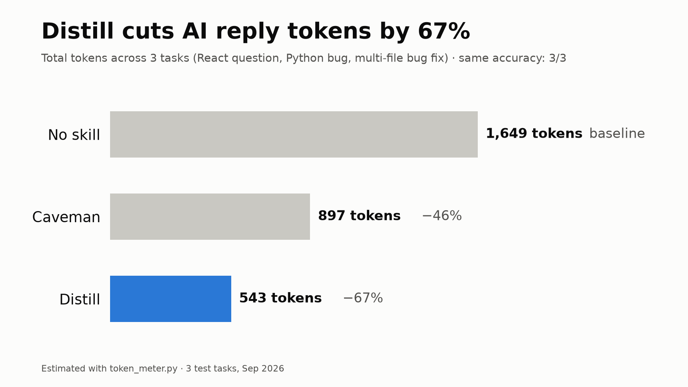

# distill

[](https://github.com/sahilnikam2410/distill/actions/workflows/ci.yml)
[](CHANGELOG.md)
[](LICENSE)

**A professional low-token mode for Claude.** Shorter answers, less tool churn, and still exact.



Popular "talk like a caveman" skills save tokens but read badly in a work chat ("Effect run twice"). They also only shorten the *words*, not the *work*: file reads, tool calls and log dumps.

distill keeps replies professional and dense, and it also trims how Claude works.

| | No skill | caveman | **distill** |
|---|---|---|---|
| Tokens across 3 tasks | 1,649 | 897 (−46%) | **543 (−67%)** |
| Correct answers | 3/3 | 3/3 | **3/3** |
| Tool calls on the bug-fix task | 6 | 4 | **4** |
| Tone | normal | broken grammar | professional |

## What it does

- **Answer on line 1.** No preamble, no recap, no "let me know if…"
- **Word budget per answer type:** simple fact ≤ 25 words, bug or concept ≤ 60, task report ≤ 40
- **Answer shapes:** Bug → `Cause / Fix / Verify` · Task → `Fixed / Tests / Open` · Decision → `Use X / Because / Tradeoff`
- **One recommended path**, not a survey of options
- **Work rules:** search before reading, run independent steps in parallel, no re-reads, filter tool output, stop at done
- **Accuracy guard:** never shortens code, commands, paths, error messages, numbers or negations ("not", "unless"). Switches to full clarity for security warnings and irreversible actions
- **Anything you ship stays full quality:** code, commits, PRs, docs and emails

## Levels

| Level | Style |
|---|---|
| `lite` | Full sentences, zero filler |
| `pro` | Labeled fragments ("Cause: … Fix: …"). Default |
| `max` | Symbols, arrows, tables, one-word answers |
| `auto` | Picks per reply (default) |
| `wenyan-lite` / `wenyan` / `wenyan-max` | Classical Chinese. Code and identifiers stay in English |

Switch with `/distill pro`, `/distill max` and so on. Say "stop distill" to turn it off.

## Install

**Claude Code: plugin**
```
/plugin marketplace add sahilnikam2410/distill
/plugin install distill@distill
```

**Claude Code: manual.** Copy `plugins/distill/skills/distill/` to `~/.claude/skills/distill/`.

**claude.ai / Claude desktop:** download `distill.skill` from the [latest release](https://github.com/sahilnikam2410/distill/releases/latest) (or [from `main`](distill.skill)) and upload it in your Skills settings.

Then type `/distill`, or just say "be brief" or "less tokens".

## Measure your own savings

```bash
python plugins/distill/skills/distill/scripts/token_meter.py before.txt after.txt
```
It uses `tiktoken` if installed, otherwise a close heuristic with no dependencies.

## Benchmark method (and its limits)

- 3 tasks: a React question, a Python bug, and a multi-file bug fix in a small project with a planted bug (`benchmark/tasks/`)
- Each task was run 3 ways: no skill, caveman, distill. The raw answers are in `benchmark/results/`
- Token counts are **estimates** from `token_meter.py`
- It's a small sample. PRs with more tasks are welcome

## Contributing

Bug reports with the prompt and reply, and new benchmark tasks, are the most useful help. See [CONTRIBUTING.md](CONTRIBUTING.md) for the layout, checks and release steps, and [CHANGELOG.md](CHANGELOG.md) for history.

```bash
pip install pytest ruff
ruff check . && pytest
python scripts/build_skill.py   # rebuild distill.skill after editing the skill
```

## License

MIT © Sahil Nikam
